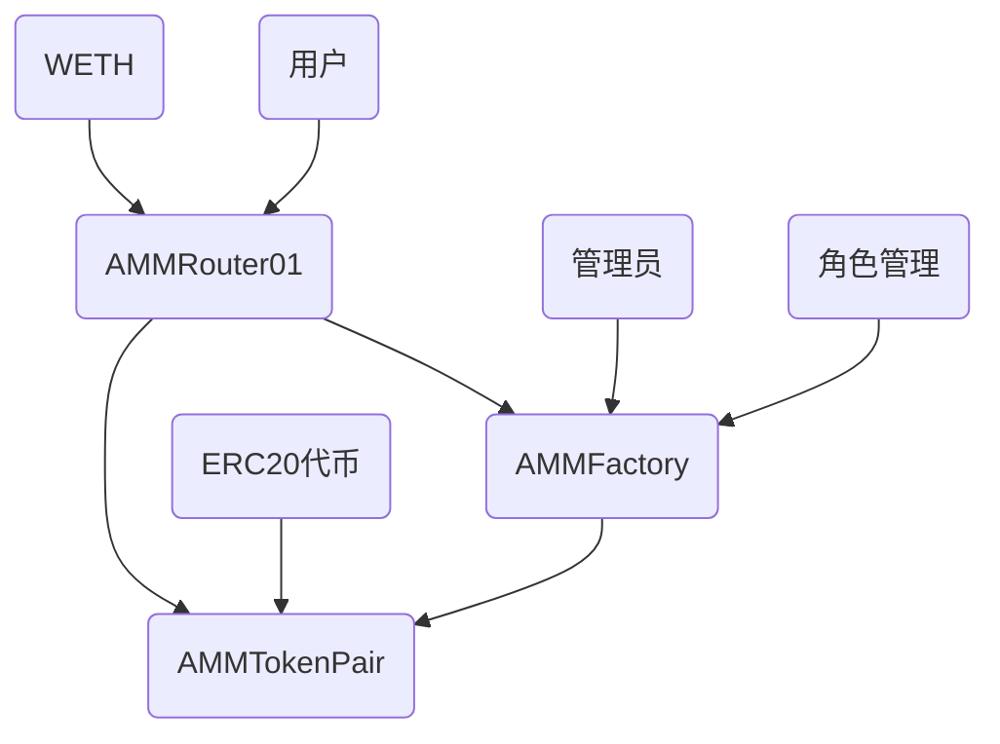

# AMM 去中心化交易所

基于 Uniswap V2 的自动做市商（AMM）平台，采用可升级合约架构，支持去中心化代币交换和流动性挖矿。集成基于角色的访问控制（RBAC）系统，提供企业级安全管理。

## 项目特性

- **可升级架构**: 基于 OpenZeppelin 的可升级合约框架
- **RBAC 权限管理**: 基于角色的访问控制系统，支持细粒度权限管理
- **安全性**: 集成重入保护、暂停机制、紧急停止和多级权限控制
- **兼容性**: 完全兼容 Uniswap V2 协议
- **类型安全**: 使用 TypeScript 和 Hardhat 开发框架

## 合约文档

- [工厂合约 (AMMFactory)](./AMMFactory.md)
- [配对合约 (AMMTokenPair)](./AMMTokenPair.md)
- [路由合约 (AMMRouter01)](./AMMRouter.md)

## 合约结构



### 核心合约

1. **AMMFactory**: 工厂合约，负责创建和管理交易对，集成 RBAC 权限系统
2. **AMMTokenPair**: 配对合约，实现具体的交易和流动性功能
3. **AMMRouter01**: 路由合约，为用户提供便捷的交互接口

## 技术架构

### 开发框架

- **Hardhat**: 以太坊开发环境
- **TypeScript**: 类型安全的开发语言
- **OpenZeppelin**: 安全的智能合约库（包括 AccessControl、Pausable 等）
- **Ethers.js**: 以太坊交互库

### 合约特性

- **可升级性**: 使用代理模式支持合约升级
- **RBAC 系统**: 基于角色的访问控制，支持多种管理角色
- **安全性**: 重入保护、暂停机制、权限控制、紧急停止
- **Gas 优化**: 优化的算法和存储布局
- **事件日志**: 完整的事件记录用于前端集成和权限审计

## RBAC 权限系统

### 角色定义

| 角色 | 权限 | 描述 |
|------|------|------|
| `DEFAULT_ADMIN_ROLE` | 超级管理员 | 可以管理所有角色，执行紧急停止 |
| `ADMIN_ROLE` | 系统管理员 | 可以管理其他角色，设置 feeToSetter |
| `PAIR_CREATOR_ROLE` | 配对创建者 | 可以创建新的交易对 |
| `FEE_MANAGER_ROLE` | 费用管理员 | 可以设置收费地址 |
| `PAUSER_ROLE` | 暂停管理员 | 可以暂停和恢复合约操作 |

### 权限功能

- **角色管理**: 支持批量授予和撤销角色
- **权限检查**: 提供便捷的权限查询函数
- **紧急控制**: 超级管理员可执行紧急停止
- **审计追踪**: 所有权限变更都有事件记录

## 主要功能

### 1. 流动性管理

- **添加流动性**: 向交易对提供代币获得 LP 代币
- **移除流动性**: 销毁 LP 代币取回代币和收益
- **流动性挖矿**: LP 代币持有者获得交易手续费分成
- **权限控制**: 创建交易对需要 `PAIR_CREATOR_ROLE` 权限

### 2. 代币交换

- **精确输入交换**: 指定输入数量进行交换
- **精确输出交换**: 指定输出数量进行交换
- **多路径交换**: 通过多个交易对进行复杂路径交换
- **ETH 支持**: 原生支持 ETH 与 ERC20 代币交换
- **暂停保护**: 合约暂停时禁止交易操作

### 3. 价格发现

- **恒定乘积公式**: x \* y = k 自动定价机制
- **价格预言机**: 内置时间加权平均价格（TWAP）
- **滑点保护**: 最小输出数量保护

### 4. 管理功能

- **费用管理**: `FEE_MANAGER_ROLE` 可设置收费地址
- **暂停控制**: `PAUSER_ROLE` 可暂停/恢复合约
- **角色管理**: `ADMIN_ROLE` 可批量管理用户角色
- **紧急停止**: `DEFAULT_ADMIN_ROLE` 可执行紧急停止

## 运行逻辑

### 部署流程

1. 部署 AMMFactory 工厂合约（可升级版本）
2. 调用 `initialize` 函数初始化合约和角色
3. 设置管理员地址和初始角色分配
4. 部署 AMMRouter01 路由合约
5. 初始化路由合约，关联工厂和 WETH 地址

### 权限管理流程

1. **初始化**: 部署者获得所有管理权限
2. **角色分配**: 管理员为不同用户分配相应角色
3. **权限验证**: 每个操作都会验证用户权限
4. **审计记录**: 所有权限变更都有事件日志

### 交易流程

1. **创建交易对**: 具有 `PAIR_CREATOR_ROLE` 的用户通过工厂合约创建交易对
2. **添加流动性**: 向交易对存入代币，获得 LP 代币
3. **代币交换**: 通过路由合约进行代币交换（需要合约未暂停）
4. **移除流动性**: 销毁 LP 代币，取回代币和收益

### 技术细节

- **CREATE2 部署**: 交易对地址可预先计算
- **代币排序**: 按地址大小排序确保唯一性
- **手续费机制**: 每笔交易收取 0.3% 手续费
- **最小流动性**: 首次添加流动性永久锁定 1000 wei
- **重入保护**: 所有状态变更操作都有重入保护

## 安全特性

### 合约安全

- **重入保护**: 防止重入攻击
- **暂停机制**: 紧急情况下可暂停合约
- **RBAC 权限控制**: 基于角色的细粒度权限管理
- **紧急停止**: 超级管理员可立即停止所有操作
- **溢出保护**: 使用 SafeMath 防止整数溢出
- **可升级安全**: 使用 OpenZeppelin 可升级合约框架

### 权限安全

- **最小权限原则**: 每个角色只有必要的最小权限
- **角色分离**: 不同功能由不同角色管理
- **批量操作**: 支持批量角色管理，提高效率
- **权限审计**: 完整的权限变更事件记录

### 经济安全

- **滑点保护**: 最小输出数量保护用户
- **截止时间**: 防止交易在不利条件下执行
- **K 值检查**: 确保恒定乘积公式不被违反
- **费用控制**: 只有授权用户可修改费用设置

## 开发指南

### 环境要求

- Node.js >= 16
- npm 或 yarn
- Hardhat

### 安装依赖

```bash
npm install
```

### 编译合约

```bash
npx hardhat compile
```

### 运行测试

```bash
npx hardhat test
```

### 部署合约

```bash
npx hardhat run scripts/deploy.ts --network <network>
```

### 权限管理示例

```typescript
// 授予配对创建权限
await factory.grantRole(PAIR_CREATOR_ROLE, userAddress)

// 批量授予权限
await factory.grantRoleBatch(PAIR_CREATOR_ROLE, [addr1, addr2, addr3])

// 检查权限
const canCreate = await factory.canCreatePair(userAddress)

// 暂停合约
await factory.pause()

// 紧急停止
await factory.emergencyStop()
```

## 测试覆盖

项目包含完整的测试套件：

- **AMMFactory.spec.ts**: 工厂合约测试，包括 RBAC 功能测试
- **AMMTokenPair.spec.ts**: 配对合约测试
- **权限测试**: 完整的角色和权限管理测试
- **安全测试**: 暂停、紧急停止等安全功能测试
- **共享工具**: 测试辅助函数和固定装置

## 许可证

GPL-3.0-or-later

## 注意事项

1. **合约升级**: 升级时需要确保存储布局兼容性
2. **权限管理**: 妥善保管管理员私钥，建议使用多签钱包
3. **角色分配**: 遵循最小权限原则，定期审查角色分配
4. **测试环境**: 在主网部署前充分测试所有权限功能
5. **Gas 费用**: 注意 Gas 费用优化，特别是批量操作
6. **安全审计**: 建议进行专业安全审计，特别关注权限系统
7. **紧急响应**: 制定紧急情况下的权限管理和合约暂停流程

## 贡献指南

欢迎提交 Issue 和 Pull Request 来改进项目。请确保：

- 遵循代码规范
- 添加相应测试，特别是权限相关测试
- 更新相关文档
- 考虑安全影响，特别是权限变更
